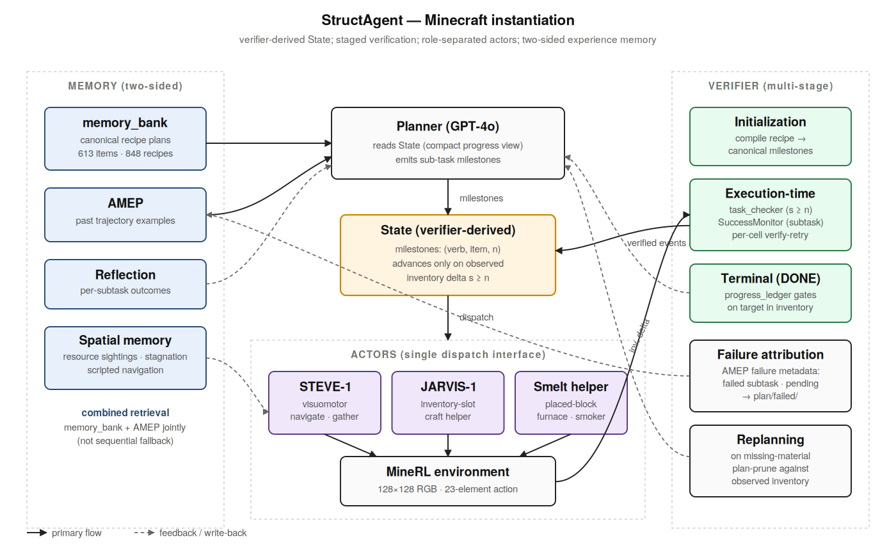
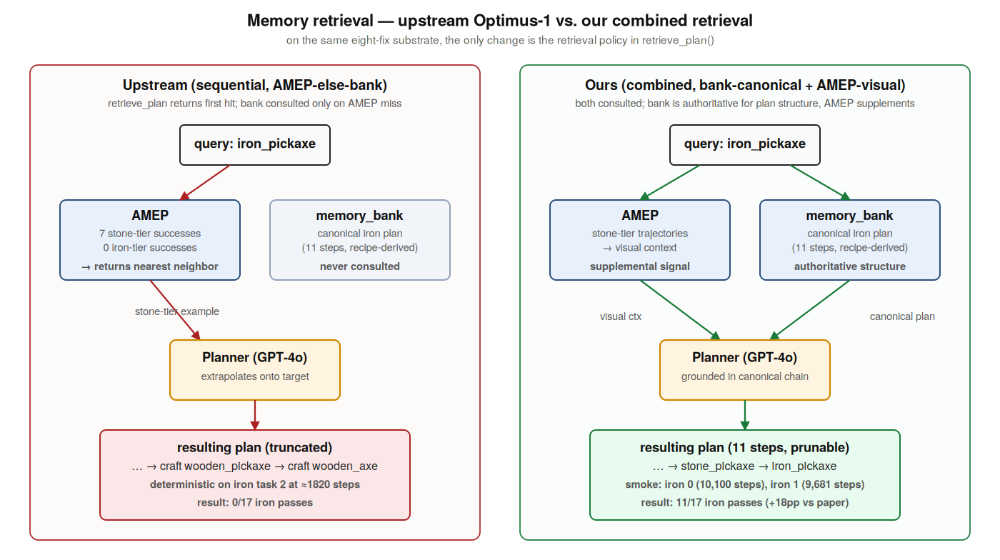
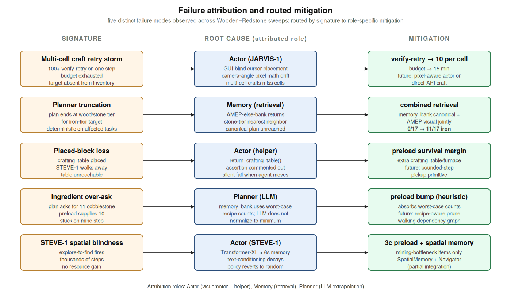

# StructAgent-Minecraft

Reference implementation of the Minecraft instantiation of StructAgent — a verifier-driven planning framework with two-sided memory (recipe-grounded knowledge graph + per-trajectory experience pool).

This repository extends [Optimus-1](https://github.com/JiuTian-VL/Optimus-1) with combined memory retrieval, a multi-stage verifier, framework-level fixes to crafting and inventory tracking, and per-tier inventory preload.

Paper: *StructAgent: A Controllable Causal System for Self-Improving CUAs* (NeurIPS 2026 submission, under review).

---

## Architecture overview



Three roles (Planner, Verifier, Actor) share access to a two-sided memory (canonical recipe-derived plans + per-trajectory experience), connected via a verifier-derived State that tracks sub-task milestones as (verb, item, count) tuples.

### Memory retrieval



The architectural contribution. Upstream Optimus-1 uses sequential retrieval (AMEP first, then fall back to memory_bank). Our combined retrieval consults both jointly: memory_bank is the authoritative source of plan structure, AMEP supplies visual context. On Iron-tier tasks, this changes the outcome from 0/17 passes to 11/17 passes on the same eight-fix substrate.

### Failure attribution



Five distinct failure modes are observed across the Wooden→Redstone sweeps; each is routed to a specific component (Actor, Memory, or Planner) and addressed by a specific mitigation. See Appendix F.5 of the paper.

### Case study

.png)

Real frames from our agent's wooden_pickaxe trajectory (left) vs. the published Optimus-1 Figure 9 trajectory for the same task (right). Same task, same crafting depth, identical knowledge graph. Our memory_bank retrieves the canonical 5-step plan up front and the agent completes in 2,431 steps with no replan. Optimus-1's planner proposes an under-resourced plan that fails at step 5 and recovers only via in-flight replan.

---

## Repository layout

```
StructAgent-Minecraft/
├── src/optimus1/                  # Agent code (forked from Optimus-1)
│   ├── main.py                    # Entry point, sweep loop, framework fixes
│   ├── memories/
│   │   └── memory.py              # Combined retrieval (memory_bank + AMEP)
│   ├── helper/
│   │   └── jarvis_craft_helper.py # Craft helper (JARVIS-1 lineage)
│   ├── env/mods/
│   │   └── task_checker.py        # Absolute-count verifier
│   ├── conf/benchmark/
│   │   ├── wooden.yaml            # Per-tier benchmark configs
│   │   ├── stone_preload.yaml
│   │   ├── iron_preload.yaml      # NEW: mining-bottleneck preload
│   │   ├── golden_preload.yaml
│   │   ├── redstone_preload.yaml
│   │   ├── diamond_preload.yaml
│   │   └── armor_preload.yaml
│   ├── spatial_memory.py          # Spatial memory subsystem
│   ├── stagnation_guard.py
│   └── spatial_navigator.py
├── memory_graph/                  # Recipe-grounded knowledge graph (subtree merge)
│   ├── memory_bank_v3.json        # 613 items, 848 typed edges
│   └── README.md
├── docs/                          # Figures
│   ├── architecture.svg/png
│   ├── memory_flow.svg/png
│   ├── failure_attribution.svg/png
│   ├── case_study_wooden.svg/png
│   └── case_study_frames/         # Real trajectory frames
└── README.md
```

---

## Installation

```bash
# Clone with submodules / subtree content
git clone https://github.com/AayushSalvi/StructAgent-Minecraft.git
cd StructAgent-Minecraft

# Create conda env (same as upstream Optimus-1)
conda create -n structagent python=3.9
conda activate structagent

# Install dependencies
pip install -r requirements.txt   # if present in upstream
# Or follow upstream Optimus-1 install instructions

# Java for MineRL
# Java 8 required; see https://minerl.io
```

### LLM configuration

Set environment variables for either OpenRouter (GPT-4o) or local vLLM:

```bash
# OpenRouter
export LLM_PROVIDER=openrouter
export LLM_MODEL=openai/gpt-4o
export OPENROUTER_API_KEY=sk-...   # NEVER commit this

# Or local vLLM
unset LLM_PROVIDER LLM_MODEL
# (defaults to localhost:8000 Qwen)
```

---

## Running

### Single task

```bash
# Wooden pickaxe, task 0
CUDA_VISIBLE_DEVICES=0 xvfb-run -a python -m optimus1.main \
    server.port=9000 benchmark=wooden evaluate="[0]" \
    env.times=1 env.max_minutes=3
```

### Tier sweep

```bash
# Run all 10 stone tasks
for id in 0 1 2 3 4 5 6 7 8 9; do
    rm -f src/optimus1/memories/v1/plan/failed/*.json
    CUDA_VISIBLE_DEVICES=0 xvfb-run -a python -m optimus1.main \
        server.port=9000 benchmark=stone evaluate="[$id]" \
        env.times=1 env.max_minutes=6 \
        2>&1 | tee /tmp/stone_${id}.log | tail -3
done
```

---

## Results summary

| Tier | Tasks | Ours SR | Ours AS | Optimus-1 SR | Optimus-1 AS | Δ SR | Δ AS |
|---|---|---|---|---|---|---|---|
| Wooden   | 12 | **100.0%** | 1,763  | 98.60% | 841.94    | +1.4 pp  | +109% |
| Stone    | 10 | 70.0%      | **2,333** | 92.35% | 2,518.88  | −22 pp   | −7%   |
| Iron     | 17 | **64.7%**  | 10,760 | 46.69% | 6,017.85  | **+18 pp** | +79%  |
| Golden   |  7 | **85.7%**  | **13,194** | 8.51%  | 15,527.07 | **+77 pp** | **−15%** |
| Redstone |  7 | **57.1%**  | 14,190 | 25.02% | 12,709.99 | **+32 pp** | +12%  |

SR = success rate. AS = average steps to completion over successful runs. Optimus-1 numbers from [Li et al. 2024](https://arxiv.org/abs/2408.03615), Table 1. Ours: n=1 per task.

**Architectural takeaway:** On every tier where Optimus-1's published SR is below 50% (Iron, Golden, Redstone), our combined retrieval + verifier-driven state substantially improves the success rate.

**Honest limitations:** n=1 sampling per task (multi-seed evaluation is future work); Iron-tier step count exceeds baseline due to multi-cell craft retry storms in the JARVIS-1 craft helper, orthogonal to the framework contribution (see Appendix F.5).

---

## Acknowledgements

This work builds on:
- [Optimus-1](https://arxiv.org/abs/2408.03615) (Li et al., NeurIPS 2024) — the upstream codebase
- [STEVE-1](https://arxiv.org/abs/2306.00937) (Lifshitz et al., NeurIPS 2023) — the visuomotor actor
- [JARVIS-1](https://arxiv.org/abs/2311.05997) (Wang et al., TPAMI 2024) — the craft helper lineage
- [MineRL](https://minerl.io) and [MineDojo](https://minedojo.org) — Minecraft simulation
- [MrSteve](https://arxiv.org/abs/2411.06736) (Park et al., ICLR 2025) — framing of the STEVE-1 spatial blindness problem

---

## Citation

```
Salvi, A. et al. StructAgent: A Controllable Causal System for Self-Improving CUAs.
NeurIPS 2026 submission, under review.
```

---

## License

This project inherits the license terms of upstream Optimus-1. See `LICENSE` for details.
